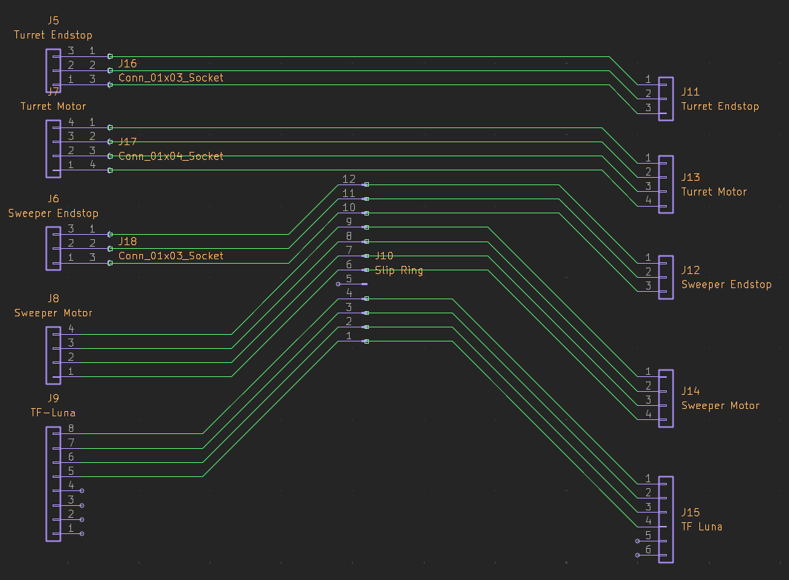

# vdar

vdar is a low-cost 3D lidar scanner using the TF-Luna. It can generate point clouds of it's environment, which can be visualized with [vvis](./vvis). vdar is completely open source, and was designed for Hack Club Stasis.

I created vdar because of a general interest in LiDAR. I've been playing with point clouds for a few years, and wanted to create a device that could generate my own clouds. I also wanted to learn how to create a mechanically more complex design, combined with designing and manufacturing an actual PCB.

## Repo Structure

- [`./hardware`](./hardware) - Design files for vdar
  - [`./hardware/cad`](./hardware/cad) - Fusion 360 & Step design files for vdar
  - [`./hardware/pcb`](./hardware/pcb) - KiCad design files for vdar
    - [`./hardware/pcb/production`](./hardware/pcb/production) - PCB Production files (gerbers.zip)
- [`./project`](./project) - Project management files for vdar
    - [`./project/assets`](./project/assets) - Media for project files
    - [`./project/docs`](./project/docs) - Assembly instructions for vdar
    - [`./project/finances`](./project/finances) - BOM & POs for vdar
- [`./vcore`](./vcore) - ESP32 firmware for vdar
- [`./vvis`](./vvis) - NodeJS visualizer for vdar

## Quick Start
Requirements:
 - PlatformIO Core
 - NodeJS
 - Python3

```bash
git clone https://github.com/vuktacic/vdar.git
cd vdar
just setup
mv ./vcore/include/secrets.h.example ./vcore/include/secrets.h
```
```bash
just build
just flash
just run
```


## Pictures
### 3D CAD


### PCB


### Offboard Wiring


