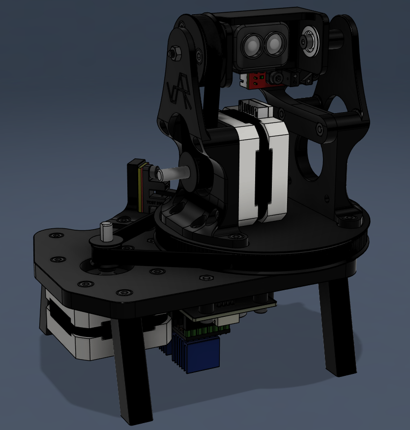
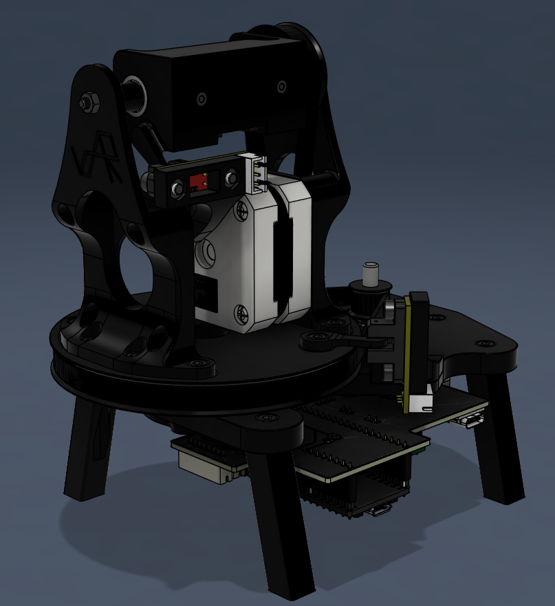
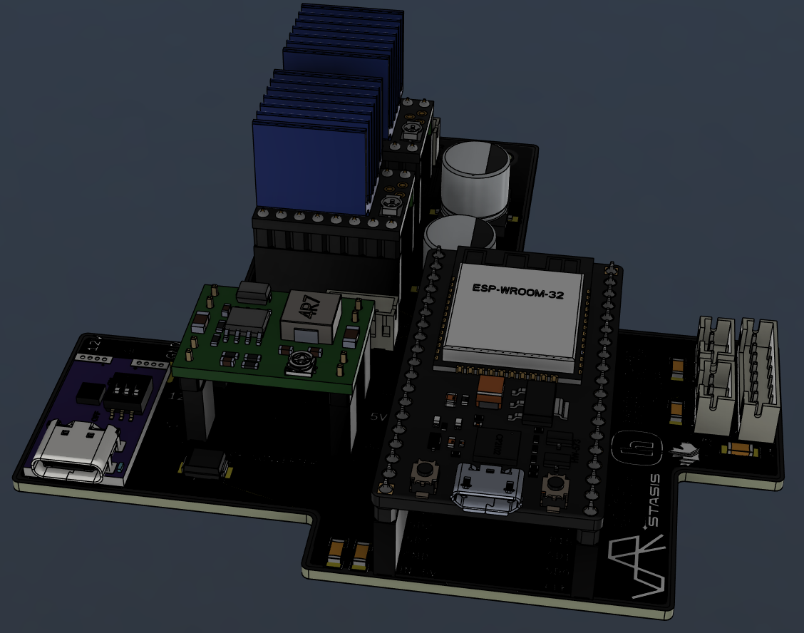
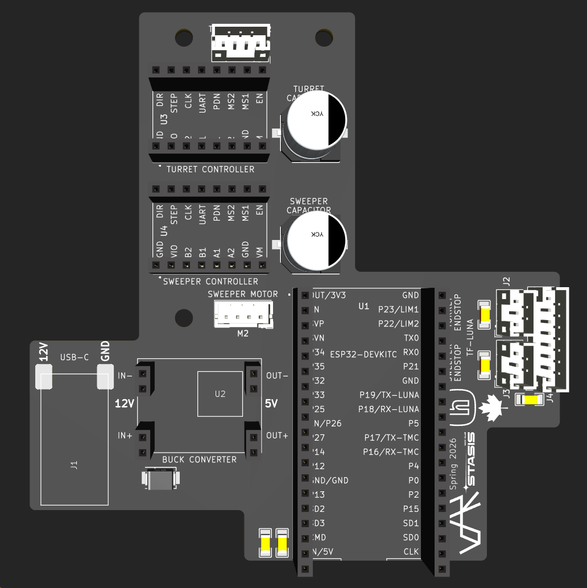
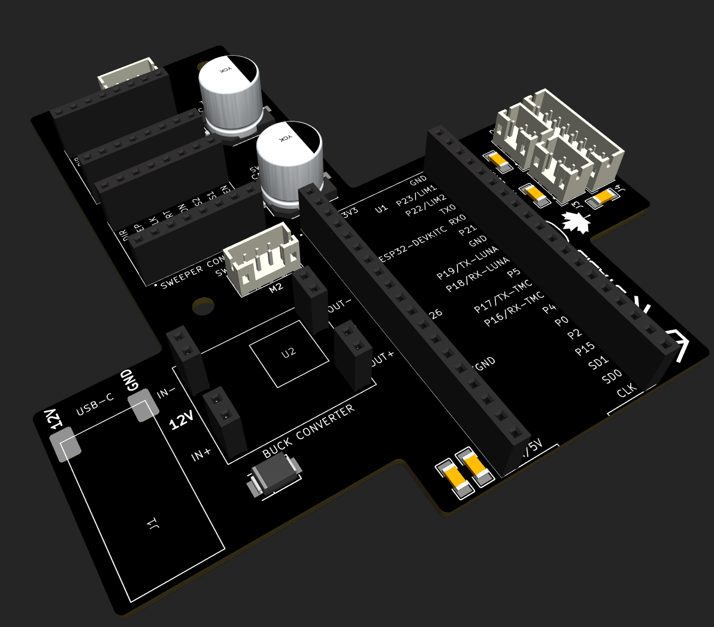

# vdar

## Repo Structure
- [`./hardware`](./hardware) - Design files for vdar
  - [`./hardware/cad`](./hardware/cad) - Fusion 360 & Step design files for vdar
  - [`./hardware/pcb`](./hardware/pcb) - KiCad design files for vdar
    - [`./hardware/pcb/production`](./hardware/pcb/production) - PCB Production files (gerbers.zip)
- [`./project`](./project) - Project management files for vdar
- [`./project/assets`](./project/assets) - Media for project files
- [`./vcore`](./vcore) - ESP32 firmware for vdar
- [`./vvis`](./vvis) - NodeJS visualizer for vdar

## Description

vdar is a low-cost 3D lidar scanner using the TF-Luna. It can generate point clouds of it's environment, which can be visualized with [vvis](./vvis). vdar is completely open source, and was designed for Hack Club Stasis.

I created vdar because of a generally interest in LiDAR. I've been playing with point clouds for a few years, and wanted to create a device that could generate my own clouds. I also wanted to learn how to create a mechanically more complex design, combined with designing and manufacturing an actual PCB.

## Pictures
### 3D CAD

### PCB

### Offboard Wiring

## Bill of Materials
| Ordered | On-hand | Item | Vendor | Qty | Total Cost (CAD) |
| --- | --- | --- | --- | ---: | ---: |
| **Mechanical** |  |  |  |  |  |
| [x] | [ ] | [NEMA 17 Motor 17HS4023](https://www.aliexpress.com/item/1005003874936862.html) | AliExpress | 3 | $30.66 |
| [x] | [ ] | [6804-2RS (20x32x7) Bearing](https://www.aliexpress.com/item/1005006415114490.html) | AliExpress | 2 | $6.82 |
| [x] | [ ] | [F604-ZZ (4x22x4) Bearing](https://www.aliexpress.com/item/1005006868220737.html) | AliExpress | 5 | $7.91 |
| [x] | [ ] | [165T 6mm Wide 2mm Pitch GT2 Timing Belt](https://www.aliexpress.com/item/1005005092316899.html) | AliExpress | 1 | $4.61 |
| [x] | [ ] | [85T 6mm Wide 2mm Pitch GT2 Timing Belt](https://www.aliexpress.com/item/1005007811742786.html) | AliExpress | 1 | $2.84 |
| **Fasteners** |  |  |  |  |  |
| [x] | [ ] | [M3D4x18 Hex Socket Cap Shoulder Bolt](https://www.aliexpress.com/item/1005008314676042.html) | Aliexpress | 10 | $4.59 |
| **Electronics** |  |  |  |  |  |
| [x] | [ ] | [Benewake TF-Luna 250Hz LIDAR Sensor](https://www.aliexpress.com/item/1005009516099639.html) | AliExpress | 1 | $31.18 |
| [x] | [ ] | [Optical Endstop](https://www.aliexpress.com/item/1005005231591120.html) | AliExpress | 6 | $6.89 |
| [x] | [ ] | [TMC2209 Stepper Driver](https://www.aliexpress.com/item/1005006323811276.html) | AliExpress | 3 | $12.78 |
| [x] | [ ] | [MP1584EN Devboard Buck Converter](https://www.aliexpress.com/item/1005007136976280.html) | AliExpress | 1 | $1.72 |
| [x] | [ ] | [12 Wire 2A Slip Ring](https://www.aliexpress.com/item/1005007805413865.html) | AliExpress | 1 | $16.32 |
| [x] | [ ] | [USB C Decoy Board](https://www.aliexpress.com/item/1005005622939899.html) | AliExpress | 1 | $1.98 |
| [ ] | [ ] | PCB | JLCPCB | 5 | $2.00 |
| [ ] | [ ] | PCB Shipping | JLCPCB | 1 | $1.50 |
| [x] | [ ] | [35V 470μF Capacitor](https://www.aliexpress.com/item/1005006853348605.html) | Aliexpress | 10 | $5.23 |
| [ ] | [ ] | [25V 10μF 1206 Capacitor](https://leeselectronic.com/en/product/81793-smd-capacitor-10uf-25v-1206.html) | Lee's Electronics | 5 | $1.25 |
| [x] | [ ] | [50V 100nF 1206 Capacitor](https://www.aliexpress.com/item/1005010653487250.html) | Aliexpress | 100 | $4.31 |
| [ ] | [ ] | [1kΩ 1206 Resistor](https://leeselectronic.com/en/product/914154-resistors-smd-1k-5-1206-20pcs.html) | Lee's Electronics | 20 | $2.00 |
| [x] | [ ] | [15Vrwm 16.7Vbr 24.4VC SMBJ15A TVS Diode](https://www.aliexpress.com/item/1005007161640002.html) | Aliexpress | 20 | $4.40 |
| --- | --- | --- | --- | ---: | ---: |
| **TOTAL OUTLAY** |  |  |  |  | **$143.06** |
| **TOTAL OUTLAY (USD)** |  |  |  |  | **$103.98** |